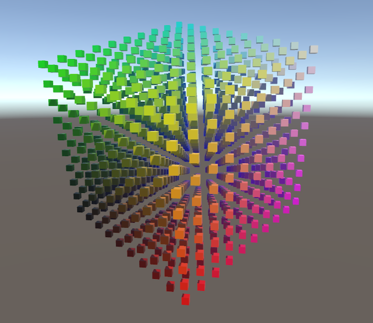

Matrices
##########

- *Create a cube grid.*
- *Support scaling, positioning, and rotating.*
- *Work with transformation matrices.*
- *Create simple camera projections.*

This is the first part of a tutorial series about the basics of rendering. 
It covers transformation matrices. 
First, go through the Mesh Basics series, which starts with `Procedural Grid <https://www.baidu.com/>`_.
Then you will know how meshes work. 
This series will explore how those meshes actually end up as pixels on a display.

This tutorial was made with Unity 5.3.1.

1. Visualizing Space
==========================
You already know what meshes are and how they can be positioned in a scene.
But how does this positioning actually work? How does a shader know where to draw?
Of course we can just rely on Unity's transform component and shaders to take care of it all,
but understanding what's actually going on is crucial if you want to gain total control.
To understand this process fully, it's best if we create our own implementation.

Moving, rotating, and scaling a mesh is done by manipulating the positions of its vertices. 
This is a transformation of space, so to see it in action we have to make space visible. 
We can do this by creating a 3D grid of points. 
The points could be any prefab.

.. code:: csharp

    using UnityEngine;

    public class TransformationGrid : MonoBehaviour {

        public Transform prefab;

        public int gridResolution = 10;

        Transform[] grid;

        void Awake () {
            grid = new Transform[gridResolution * gridResolution * gridResolution];
            for (int i = 0, z = 0; z < gridResolution; z++) {
                for (int y = 0; y < gridResolution; y++) {
                    for (int x = 0; x < gridResolution; x++, i++) {
                        grid[i] = CreateGridPoint(x, y, z);
                    }
                }
            }
        }
    }
